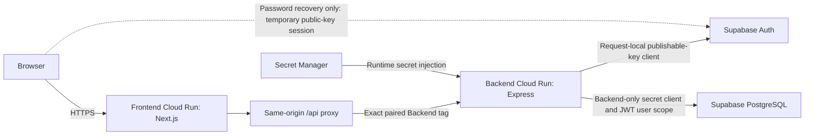
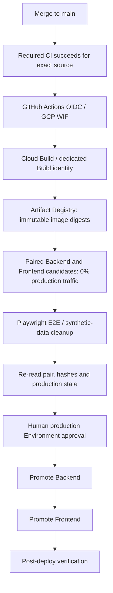

# Workout Journal

[Live Demo / Production](https://workout-journal-frontend-cpbzb7lqza-an.a.run.app) · [日本語](./readme_Japanese)

Workout Journal keeps strength-training sessions organized by date. Record the exercises, sets and effort for a session, revisit an earlier workout, and compare trends before deciding what to do next. The calendar preserves session context; analytics turns those notes into a view of training consistency, volume and strength progression.

The live link is the stable Frontend Cloud Run service URL. The [production evidence record](./docs/portfolio-finalization.md#current-production) separates dated verified checkpoints from exact current revisions, which are owned by live Cloud Run read-back. Product v1 and the defined [Portfolio Finish scope](./docs/portfolio-completion-contract.md) are complete; future improvements remain outside that completion boundary.

## What you can do

- **Manage a session:** sign up, log in, refresh a session, log out, update a username, or recover a forgotten password by email.
- **Keep dated workout notes:** create, save and reopen notes with exercise names, exercise notes, weight, reps and rest; add, duplicate or remove exercises and sets. Edits are saved through the authenticated notes API.
- **Record effort:** optional set-level RPE, RIR and failure inputs feed effort summaries without treating missing values as zero effort.
- **Navigate your history:** browse the monthly calendar, organize sessions with personal tags, and find previous notes by tag. Create and delete tags from the catalog.
- **Review progress:** select a date range for BIG3 estimated one-rep-max trends, muscle-group sets/volume, exercise trends with table fallbacks, effort summaries and five deterministic Growth Signals: strength, volume, consistency, effort and exercise progress.
- **Read a weekly summary:** a rule-based preview explains the recorded data. The optional generation endpoint currently uses a local mock provider with fallback; external AI is not integrated.

## Architecture



Application requests use the Frontend origin, including refresh cookies. The server-only `BACKEND_INTERNAL_URL` selects the paired Backend revision. The Backend remains publicly invocable by design; the proxy is not a private-network boundary, and application authorization is enforced by Backend JWT verification and user-scoped queries.

The browser never receives the Supabase secret key or accesses application tables directly. Password recovery is the explicit exception: it uses a temporary Supabase Auth session with public configuration, updates the password, then clears that session.

## Stack

| Area | Technology |
| --- | --- |
| Frontend | Next.js 15.5.24 Pages Router, React 18, TypeScript, Chakra UI, Recharts |
| Backend | Node.js 24, Express 5.2.1, Supabase JavaScript client |
| Data and identity | Supabase Auth and PostgreSQL; versioned schema migrations |
| Delivery | GitHub Actions, Google Cloud WIF, Cloud Build, Artifact Registry, Cloud Run |
| Infrastructure and operations | Terraform 1.16, Secret Manager, Cloud Logging, Cloud Monitoring |
| Verification and security | Jest, Playwright, offline Node/Python contract tests, CodeQL, Dependabot |

## Engineering decisions

- **A same-origin API boundary** keeps browser API calls and refresh cookies on the Frontend origin while allowing Frontend and Backend to deploy as separate services.
- **Backend-only database authority** separates request-local Supabase Auth clients from the privileged DB client. Application tables have RLS enabled with no browser access policies; Backend authorization owns user isolation.
- **Paired releases** bind an immutable Frontend image to an exact Backend tagged URL. Tags referenced by production or rollback-eligible Frontends must not move or disappear.
- **Separate Terraform and delivery ownership** lets Terraform manage the foundation while CD owns Cloud Run images, revisions, runtime configuration, tags and traffic. Terraform does not reconcile mutable release state.
- **Human production approval** is retained after automated candidate checks. Automation prepares evidence and verifies promotion; it does not approve production on the owner's behalf.

## CI/CD and recovery



The controller binds the CI run and attempt to the exact main source, rejects stale or expired candidates, and rechecks captured production before promotion. WIF provides short-lived credentials instead of a long-lived GCP service-account key. A separate E2E identity accesses only its dedicated credential.

Recovery restores a recorded compatible pair, Frontend first and then Backend, followed by verification. Failed or uncertain rollback is surfaced for Human action. See the [deployment and rollback runbook](./docs/cloud-run-deployment-runbook.md) for authority checks, retention rules and recovery commands.

## Testing strategy

| Layer | Role / command |
| --- | --- |
| Jest | Shared calculations, UI behavior, API/proxy contracts, and Backend services with mocked dependencies: `npm test` |
| Offline E2E contracts | Candidate identity, lifecycle, cleanup and result transport: `npm run e2e:test` |
| Offline delivery / infrastructure contracts | Python controller tests plus Terraform mock plans; no cloud apply or credentials |
| Required GitHub CI | Separate installs, Frontend lint/build, Backend syntax build, Jest and both offline contract layers |
| Candidate Playwright E2E | Login, note create/save/read, tag create/use/delete, Calendar, Analytics and logout on the exact HTTPS pair; cleanup must be proven |
| Production verification | CD post-deploy checks and Cloud Run read-back; release records retain the executed browser-smoke evidence |

Password recovery depends on external email and is outside the automated candidate E2E gate; its separate verification and setup boundary are documented. No coverage percentage or broad browser matrix is claimed. Exact local/CI commands and dated results live in [Verification](./docs/verification.md) and the [E2E runbook](./docs/e2e-smoke-runbook.md).

## Security, infrastructure and observability

Secret Manager injects Backend secrets at runtime. Real `.env` files are ignored, while example templates remain trackable. Protected `main` requires the strict GitHub Actions quality check. CodeQL Default setup analyzes Actions and JavaScript/TypeScript; Dependabot alerts/security updates are enabled, and monthly version updates cover npm, Actions, Docker and Terraform. These controls do not imply that every dependency advisory is resolved.

Terraform owns the approved registry, service accounts, additive IAM/WIF, secret metadata and Monitoring resources. Secret payloads and versions stay outside Terraform; Supabase is managed separately. The [ownership matrix](./docs/portfolio-infra-ownership.md) defines the boundary.

Backend `/health` is dependency-free and backs Cloud Run startup/liveness probes. Allow-listed structured failure logs avoid raw requests, identities and secrets. Monitoring checks Frontend availability and alerts on sustained Backend 5xx across all revisions, including tagged candidates. Alerts support diagnosis and Human recovery; they do not automatically change traffic. See [observability and recovery](./docs/cloud-run-deployment-runbook.md#observability).

## Technical documentation

- [System design](./docs/system-design.md): features, contracts, data model and design boundaries.
- [Deployment / rollback runbook](./docs/cloud-run-deployment-runbook.md): candidates, approval, promotion and recovery.
- [Verification](./docs/verification.md): testing layers and observability evidence.
- [Terraform ownership](./docs/portfolio-infra-ownership.md) and [Terraform setup](./infra/terraform/README.md): foundation versus delivery state.
- [Supabase strategy](./supabase/README.md): schema, Auth, RLS and clean-start policy.
- [Portfolio Completion Contract](./docs/portfolio-completion-contract.md): completed Must conditions and scope boundary.
- [Production checkpoints and repository maturity](./docs/portfolio-finalization.md): verified production, repository metadata, Release and license status.
- [Original v1 production release](./docs/releases/workout-journal-v1.md): historical known-good artifact and smoke record.

## Run locally

Use Node.js 24 and npm. Provision a separate development Supabase project following the [schema and setup order](./supabase/README.md#migration-order); the app needs the application tables and RPC as well as Auth.

```bash
git clone https://github.com/tyosu131/Workout-Journal.git
cd Workout-Journal
npm ci
npm ci --prefix frontend
npm ci --prefix backend
cp backend/.env.example backend/.env
cp frontend/.env.example frontend/.env
```

Fill the two ignored files using their [Backend](./backend/.env.example) and [Frontend](./frontend/.env.example) templates. Set Backend `SUPABASE_URL`, publishable key, secret key and a development-only `JWT_SECRET`. Use the same Supabase project for the Frontend public URL/key; only those public recovery values belong in `NEXT_PUBLIC_*`. Keep `BACKEND_INTERNAL_URL=http://localhost:3001` server-only. Register `http://localhost:3000/reset-password` in Supabase's allowed redirects and set Backend `PASSWORD_RESET_REDIRECT_URL` to it. Never copy production secrets into tracked files.

```bash
npm run dev
```

Open `http://localhost:3000`. The Frontend proxies `/api/*` to the local Backend on port 3001. Sign in, select a calendar date and record a session. Account email changes and logged-in password changes are not implemented.

## License

MIT licensed. See [LICENSE](./LICENSE).
