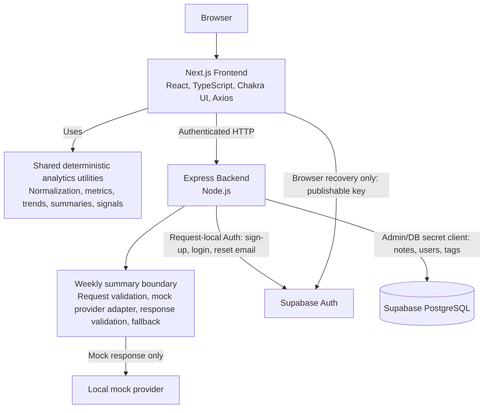

# Workout-Journal System Design

## Scope and Status Language

This document is a concise system-design overview for Workout-Journal. It describes eight completed sections in this revision: Requirements, High-level Architecture, Data Model, Component Responsibilities, API Design, Async Jobs, Failure Handling, and Observability.

Every claim below is labelled as one of the following:

- **Current / Implemented**: confirmed in the current repository code.
- **Verified Infrastructure Fact**: confirmed by the reviewed Supabase backup, rather than inferred from application code.
- **Current Design Decision**: an explicit current boundary or policy reflected in code and supporting design material.
- **Future Direction**: a proposed next step, not an implemented capability.
- **Open Question**: not verified from this repository or the reviewed backup.

## 1. Requirements

### Product Goal

**Current / Implemented:** Workout-Journal is a daily workout note application. Its central value is recording workouts by date, revisiting prior sessions, and making progressive overload and training trends easier to inspect through the calendar and Analytics page.

**Current / Implemented:** The primary workflow is intentionally simple: log exercises and sets inside a dated note, then use date-range analytics to review strength, volume, exercise, effort, and growth information before the next session.

### Functional Requirements

| Capability | Status | Current behavior |
| --- | --- | --- |
| Authentication and account management | **Current / Implemented** | The application supports sign-up, login, session lookup, token refresh, user lookup/update, and browser password recovery. A sessionless Supabase sign-up returns `verificationRequired` without backend tokens or a profile; a later successful login can create the missing profile before issuing backend JWTs. Verification resend routing and authentication remain unresolved. |
| Daily workout logging | **Current / Implemented** | A note is opened for a date and saved through the authenticated notes API. The calendar links users to dated note screens and displays note/tag state. |
| Exercise and set recording | **Current / Implemented** | A note contains exercises; each exercise has a name, optional exercise note, and a sequence of sets with weight, reps, and rest. Add, duplicate, and delete operations are present in the note editor. |
| Optional set effort input | **Current / Implemented** | An expandable Effort row provides RPE in 0.5 steps from 1 to 10, RIR from 0 to 10, and a failure checkbox. The frontend normalizes these values before saving; backend save normalization preserves valid optional intensity fields. |
| Calendar, history, and tag lookup | **Current / Implemented** | The top page provides a calendar. Notes can be queried by date, date range, and overlapping tags; the note screen can find a prior tagged note. |
| User-defined tags | **Current / Implemented** | Note tags are saved with notes. The backend also creates, lists, and deletes user-scoped tag catalog entries in `user_tags`. |
| Date-range analytics | **Current / Implemented** | The Analytics page fetches the authenticated notes range, normalizes nested sets, and derives analytics for selectable 4-week, 8-week, 12-week, 6-month, and all-time ranges. |
| Exercise trends | **Current / Implemented** | The Exercises tab groups known aliases through current exercise metadata, retains unmatched names as raw groups, supports four metrics, and keeps an exact-value table fallback. |
| BIG3, volume, effort, and Growth Signals | **Current / Implemented** | Analytics shows BIG3 estimated-1RM trends, muscle-group sets or volume load, set-level effort summaries, and five deterministic Growth Signals: strength, volume, consistency, effort, and exercise progress. |
| Weekly summaries | **Current / Implemented** | The frontend builds deterministic aggregate input, renders a rule-based preview, and can call an authenticated backend weekly-summary endpoint backed by a mock provider. |

#### Weekly Summary Boundary

| Area | Status | Current behavior |
| --- | --- | --- |
| Deterministic input and rule-based summary | **Current / Implemented** | Shared utilities build range-bounded aggregate input from note count, normalized sets, BIG3, muscle groups, effort, Growth Signals, and data-quality notes. A rule-based summary renders without an AI call. |
| Backend endpoint | **Current / Implemented** | Express exposes `POST /analytics/weekly-summary`. It validates an authenticated request, accepts structured `summaryInput`, and returns a structured summary plus a source indicator. |
| Provider adapter and mock behavior | **Current / Implemented** | The backend service uses a provider contract with `generateWeeklySummary(promptMessages)`. The default adapter is a local mock that returns a fixed JSON response; invalid responses and provider errors return a rule-based fallback. |
| External AI provider integration | **Future Direction** | No provider SDK, API key, environment setting, or network call to an external AI provider is implemented. |
| Summary persistence | **Current Design Decision** | Generated summaries are returned on demand and are not currently persisted. |
| Summary history or cache | **Future Direction** | Optional persistence or caching needs a separate schema, invalidation, retention, and privacy design. |

### Non-functional Requirements

| Concern | Status | Current boundary or requirement |
| --- | --- | --- |
| Authentication and user isolation | **Current / Implemented** | Protected note and weekly-summary paths extract a Bearer token, verify the backend JWT, and scope note/tag database queries by the verified user ID. |
| Secret management | **Current / Implemented** | Backend Supabase credentials and `JWT_SECRET` are read from backend environment files; browser-visible configuration is limited to `NEXT_PUBLIC_*` values. The README instructs deployments to configure real values outside repository files. |
| Sensitive logging | **Current / Implemented** | The weekly-summary service does not log prompt messages, mock/provider response text, tokens, or workout payloads. Its request validator rejects named raw-note-content fields. |
| Logging policy completeness | **Open Question** | A repository-wide sensitive-logging policy is not enforced centrally. Current auth handlers still log decoded user IDs and Supabase query results, so a broader production logging audit remains necessary. |
| Backward compatibility | **Current / Implemented** | Missing `rpe`, `rir`, and `failure` normalize to `null`; old nested sets remain readable. The backend only adds valid effort fields and otherwise keeps the surrounding exercise/set payload shape. |
| Defensive parsing and validation | **Current / Implemented** | Nested exercises are parsed defensively, numeric metrics require finite values, effort values are range-normalized, and weekly-summary requests and responses are validated before use. |
| CI verification | **Current / Implemented** | GitHub Actions installs root, frontend, and backend dependencies, then runs frontend lint/build, backend syntax checks, and the root Jest suite on pushes and pull requests. |
| Mobile usability | **Current / Implemented** | The note editor and Analytics components use responsive Chakra UI layouts, including collapsible effort controls, stacked summary cards, wrapped controls, and horizontally scrollable data tables. |
| AI privacy and response validation | **Current / Implemented** | The current weekly-summary request is structured aggregate data only; named raw note text fields are rejected. Backend responses are bounded and shape-validated before an `ai` result is returned, with a deterministic fallback on failure. |

### Non-goals

- **Current Design Decision:** Do not immediately migrate to fully normalized workout tables.
- **Current Design Decision:** Do not bulk rewrite existing `notes.exercises` payloads merely to add optional effort fields.
- **Current Design Decision:** Do not initially persist generated weekly summaries, prompt payloads, provider responses, tokens, or secrets.
- **Current Design Decision:** Do not send raw workout note text to the weekly-summary provider boundary.
- **Current Design Decision:** Do not provide medical diagnosis, injury treatment, or a fixed training prescription through summaries or signals.
- **Current Design Decision:** Do not store derived analytics rows before a demonstrated query or product need exists.

## 2. High-level Architecture

### Current Architecture



**Current / Implemented:** The frontend is a Next.js Pages Router application using React, TypeScript, Chakra UI, Axios, and Recharts. It owns interactive note editing, calendar/history screens, authenticated API calls, and responsive Analytics rendering.

**Current / Implemented:** The backend is a Node.js and Express service. It owns authentication handlers, bearer-token verification, note and tag persistence, request validation, and the current weekly-summary endpoint boundary.

**Current / Implemented:** The backend uses request-local Auth clients for sign-up, login, and password-reset email requests. Browser password recovery alone connects directly to Supabase Auth through a temporary client configured with the publishable key; the Admin/DB secret client remains backend-only for PostgreSQL and RPC operations.

**Current / Implemented:** Shared TypeScript utilities are used by the frontend to normalize persisted note data and compute deterministic metrics, chart series, weekly summary input, rule-based summaries, prompt payloads, response validation, and Growth Signals.

**Current / Implemented:** The backend weekly-summary skeleton is JavaScript-local rather than a runtime import of the shared TypeScript prompt/response helpers. It implements equivalent mock-provider, validation, and fallback boundaries in backend utilities.

**Open Question:** A single cross-runtime strategy for reusing shared TypeScript summary utilities from the JavaScript backend has not been implemented.

### Responsibility Boundaries

| Boundary | Status | Responsibility |
| --- | --- | --- |
| Frontend | **Current / Implemented** | Collect and display note data; attach the access token; fetch user-scoped notes; derive and render analytics; construct the structured weekly-summary request; show rule-based, mocked-endpoint, and fallback states; and use a temporary publishable-key client only for browser password recovery. |
| Backend | **Current / Implemented** | Authenticate requests; use request-local Auth clients for sign-up, login, and password-reset email requests; enforce user-scoped note/tag database operations through the Admin/DB secret client; normalize nested exercise intensity fields before saving; validate weekly-summary requests; call the local mock provider boundary; validate provider-shaped responses; and return fallback output when needed. |
| Shared analytics | **Current / Implemented** | Parse nested exercise payloads into normalized sets and derive metrics, weekly volume, BIG3 trends, muscle groups, effort summaries, Growth Signals, weekly summary input, and provider-neutral prompt payloads without network or database calls. |
| Supabase | **Current / Implemented** | Authenticate backend sign-up/login/password-reset-email requests and browser recovery-session password updates. Store application data accessed only through the backend Admin/DB secret client, including `notes`, users, and the user tag catalog. |
| Weekly summary | **Current / Implemented** | Keep deterministic rule-based output available independently of the mocked endpoint; use only structured aggregate input at the current backend boundary; validate returned structured output before rendering it as an endpoint response. |

### API Path Clarification

| Path layer | Status | Observed behavior |
| --- | --- | --- |
| Express internal mounts | **Current / Implemented** | `backend/server.js` mounts `authRoutes` at `/auth`, `noteRoutes` at `/notes`, and `analyticsRoutes` at `/analytics`. The weekly-summary route is therefore `POST /analytics/weekly-summary` inside Express. |
| Frontend API base | **Current / Implemented** | Axios uses `NEXT_PUBLIC_API_URL`, defaulting to `http://localhost:3001`, and frontend runtime clients call the Express paths directly: `/auth/*`, `/notes/*`, and `/analytics/*`. |
| Next.js API routing | **Current / Implemented** | No Next.js API routes, rewrites, or proxy configuration are used for backend requests. Frontend runtime calls rely on `NEXT_PUBLIC_API_URL` resolving to the Express service. |
| Production/public API origin | **Open Question** | The repository does not define the deployed value of `NEXT_PUBLIC_API_URL` or its hosting/network configuration. Production must make the Express service reachable at that configured origin; no `/api/*` alias is required by the frontend runtime. |
| Weekly-summary public route | **Current / Implemented** | The frontend calls `POST /analytics/weekly-summary` through the same API base, matching the Express mount. |

## 3. Data Model

### Verified Historical Backup Schema

**Verified Infrastructure Fact:** The reviewed PostgreSQL cluster backup documents this `public.notes` table shape:

| Column | Type | Nullability |
| --- | --- | --- |
| `date` | `text` | `NOT NULL` |
| `note` | `text` | nullable |
| `exercises` | `text` | nullable |
| `userid` | `uuid` | nullable |
| `tags` | `text[]` | nullable |

**Verified Infrastructure Fact:** The reviewed backup declares `PRIMARY KEY (date)`, `UNIQUE (date, userid)`, and `FOREIGN KEY (userid) REFERENCES public.users(uuid) ON DELETE CASCADE` for `public.notes`.

**Verified Infrastructure Fact:** The reviewed backup did not show an RLS policy on `public.notes`, nor a trigger or constraint that validates the nested shape inside `notes.exercises`.

### Data Model Risk: Daily Note Key

**Verified Infrastructure Fact:** The reviewed backup contains both `PRIMARY KEY (date)` and `UNIQUE (date, userid)` for `public.notes`.

**Current / Implemented:** `saveNote` upserts a note using `(date, userid)` as its conflict target and adds the verified user ID to the row.

**Current Design Decision:** The repository's merged [target schema migration](../supabase/migrations/20260724000000_create_workout_journal_schema.sql) defines `PRIMARY KEY (date, userid)`, matching the application's upsert conflict target and the intended one-user, one-date, one-note model.

**Future Direction:** The target migration has not been applied to an isolated new Supabase project. The next work is migration application, the read-only [validation SQL](../supabase/validation/validate_initial_schema.sql), and multi-user end-to-end verification before legacy application data is imported.

**Open Question:** The historical legacy schema is verified only through the reviewed backup; its complete DDL and runtime behavior remain unverified.

**Current Design Decision:** The historical legacy schema is migration evidence and is not treated as the target schema for the new project.

### Persisted Application Shape

| Item | Status | Current representation and persistence boundary |
| --- | --- | --- |
| Daily note | **Current / Implemented** | The frontend `NoteData` contains `date`, `note`, `exercises`, and optional `tags`. The backend stores `date`, `note`, serialized `exercises`, `tags`, and verified `userid`. |
| Exercise | **Current / Implemented** | An exercise is `{ exercise: string, note?: string, sets: Set[] }`. The exercise name and optional exercise note are nested inside the serialized `notes.exercises` payload. |
| Set | **Current / Implemented** | A set has string-form primary input fields `weight`, `reps`, and `rest`. Optional RPE and RIR accept string, number, or null; failure accepts boolean or null. |
| Effort field persistence | **Current / Implemented** | The frontend serializes the exercise array. Backend save normalization accepts an array or JSON string, preserves surrounding exercise/set fields, normalizes valid RPE/RIR/failure values, and omits null/invalid optional effort fields before saving JSON text. |
| Tags on notes | **Current / Implemented** | The save payload always supplies a tags array; the reviewed schema stores it in `notes.tags` as `text[]`. |
| User-created tag catalog | **Current / Implemented** | Backend tag operations read and write `user_tags` rows scoped by `user_id`, and delete uses the `remove_tag_from_notes` RPC to remove a tag from note rows. |
| `user_tags` target schema and RPC definition | **Current Design Decision** | The [target schema migration](../supabase/migrations/20260724000000_create_workout_journal_schema.sql) defines `public.user_tags` with `UNIQUE (user_id, tag)`. The [target RPC migration](../supabase/migrations/20260724000100_create_remove_tag_from_notes.sql) defines user-scoped `remove_tag_from_notes`; neither target migration has been applied to a new Supabase project. |

**Open Question:** The repository target definitions do not establish complete equivalence with the historical legacy `user_tags` DDL or RPC implementation.

### Derived Analytics Model

**Current / Implemented:** `normalizeWorkoutSets` reads an exercise array or JSON string and produces `NormalizedWorkoutSet` records in the application layer. A normalized set contains the source date and user ID, exercise name and note, set index, numeric-or-null weight/reps/rest, RPE/RIR/failure, and copied tags.

**Current / Implemented:** `addTrainingMetricsToSet` adds derived `volumeLoad` and estimated 1RM. The current estimated-1RM calculation uses weight and reps, rejects non-positive values and repetitions above 12, and does not persist its result.

**Current / Implemented:** The Analytics page derives the following from authenticated range notes on demand; these values are not written back as analytics rows:

| Derived value | Source boundary |
| --- | --- |
| Parsed numeric set fields and effort values | `normalizeWorkoutSets` |
| Volume load and estimated 1RM | `trainingMetrics` |
| Week starts and per-exercise weekly volume with average RPE/RIR | `weeklyTrainingVolume` |
| BIG3 trend points, latest top set, and maximum estimated 1RM | `big3Trend` plus exercise metadata |
| Weekly muscle-group sets and volume load | `muscleGroupVolume` plus exercise metadata |
| Exercise chart series and canonical exercise selector groups | graph utilities and frontend analytics helpers |
| Effort coverage, average RPE/RIR, and failure count | `effortAnalytics` |
| Strength, volume, consistency, effort, and exercise-progress signals | `growthSignals` |
| Structured input for rule-based and future provider-backed summaries | `weeklySummaryInput` |

**Current Design Decision:** Missing effort values are treated as unknown rather than zero or low effort. `failureCount` counts only `failure === true`.

### Exercise Metadata

**Current / Implemented:** `shared/constants/exerciseMetadata.ts` contains a curated metadata list with canonical names, aliases, primary and optional secondary muscles, movement metadata, and optional BIG3 lift types. Case-insensitive alias matching supports the current BIG3, muscle-group, and canonical exercise-trend views.

**Future Direction:** A DB-backed or user-defined custom exercise catalog remains a candidate for future work. It is not an implemented database model or backend feature in this branch.

### Store vs. Derive

| Classification | Status | Examples |
| --- | --- | --- |
| Persist in database | **Current / Implemented** | Daily note fields, serialized nested exercises/sets, note tags, verified user ID, user account records, and user tag catalog entries. |
| Derive on demand | **Current / Implemented** | Normalized sets, numeric parsing, metrics, weekly volume, BIG3 trends, muscle-group volume, exercise series, effort summaries, Growth Signals, weekly summary input, and rule-based summaries. |
| Do not store initially | **Current Design Decision** | Weekly-summary prompt payloads, mock/provider responses, generated summary history, access tokens, refresh tokens, Supabase credentials, and AI-provider secrets are not persisted as application data. |
| Future persistence candidate | **Future Direction** | An optional weekly-summary cache/history, a custom exercise catalog, or normalized workout-set rows may be considered only when a demonstrated product or query need justifies their schema and lifecycle cost. |

**Current / Implemented:** The current weekly-summary input is aggregate data: range bounds, note and set counts, BIG3 aggregates, muscle-group aggregates, effort summary, Growth Signals, and data-quality notes. Raw workout note text is not part of the current provider-facing data shape.

## 4. Component Responsibilities

### Component Boundaries

| Component | Status | Owns | Must not own |
| --- | --- | --- | --- |
| Next.js pages and feature components | **Current / Implemented** | Page routing, interactive note/calendar/account screens, and responsive presentation. | Direct database access, backend service logic, provider secrets, or service-role credentials. |
| Frontend API clients | **Current / Implemented** | Axios base configuration, authenticated request headers, feature-level request wrappers, and response delivery to feature code. | Supabase persistence, business aggregation, or durable UI state. |
| Frontend authentication and token handling | **Current / Implemented** | Local access-token storage, client session checks, redirect behavior, and retrying a failed request after refresh. | Backend JWT signing, refresh-token issuance, server-side revocation, or provider secrets. |
| Analytics page orchestration | **Current / Implemented** | Fetching range notes, normalization, metric aggregation, chart/summary inputs, range-local UI state, and rendering Analytics sections. | Persisting derived analytics, changing note records, or replacing deterministic analytics with a provider result. |
| Express server and middleware | **Current / Implemented** | Environment loading, CORS, JSON/cookie middleware, internal route mounts, and global 404/error middleware. | Feature-specific analytics calculation or provider-specific model behavior. |
| Auth routes and service | **Current / Implemented** | Route registration; Supabase Auth operations; user record updates; backend access/refresh JWT issuance; and protected user/session operations. | Note persistence, training aggregation, or frontend token storage. |
| Note routes and service | **Current / Implemented** | Thin note/tag route registration, bearer-token checks, user-scoped `notes` and `user_tags` operations, note upsert, and nested effort-field normalization. | Computing derived charts/signals or issuing authentication tokens. |
| Shared deterministic analytics utilities | **Current / Implemented** | Pure normalization, metric calculation, trend/volume/effort aggregation, Growth Signals, weekly-summary input, rule-based summary, and provider-neutral prompt data. | Database access, network calls, UI state, Express request handling, or secret access. |
| Weekly-summary route and service | **Current / Implemented** | Bearer-token extraction and authenticated handling, weekly-summary request validation, prompt-message construction orchestration, provider-adapter invocation, provider-shaped response validation, rule-based fallback selection, and HTTP response construction. | Frontend analytics UI state, direct note persistence, generated-summary persistence, provider-specific SDK/configuration details, or secrets exposed to the frontend. |
| Weekly-summary provider adapter | **Current / Implemented** | The narrow `generateWeeklySummary(promptMessages)` contract and the current local mock response. | Authentication, authorization, note-range retrieval, database access, fallback policy, HTTP response construction, or frontend state. |
| Supabase Auth | **Current / Implemented** | Request-local backend Auth-client sign-up, password sign-in, and password-reset email requests; plus temporary browser recovery-client session establishment and password updates. These are separate from the backend-only Admin/DB secret client. | Application analytics derivation, frontend routing, weekly-summary generation, or Admin/DB secret-client operations. |
| Supabase PostgreSQL | **Current / Implemented** | Persisted application records accessed by the backend, including notes, users, and the user tag catalog. | On-demand analytics, Growth Signals, or initial weekly-summary persistence. |
| Exercise metadata | **Current / Implemented** | Static canonical names, aliases, muscle metadata, and BIG3 lift classification used by deterministic analytics. | User-defined exercise catalog persistence, fuzzy matching, or user goal inference. |
| CI verification boundary | **Current / Implemented** | Independent dependency installation plus frontend lint/build, backend syntax checking, and root Jest verification on push and pull request. | Deployment, production health monitoring, or runtime authorization. |

**Current Design Decision:** Frontend code does not receive a backend Supabase key or an AI-provider secret. The current provider adapter is local and mocked; external provider configuration remains outside this implementation.

**Future Direction:** A future external provider call should be isolated behind the provider adapter. Provider SDK, model settings, timeout, and secret access should not leak into routes, frontend code, or shared deterministic analytics. External provider integration is not currently implemented.

**Open Question:** The repository contains `backend/services/userService.js`, but the mounted route modules inspected here do not import it. Its runtime reachability and intended ownership need confirmation before it is treated as part of the HTTP API surface.

### Dependency Direction

**Current / Implemented:** The primary request path is:

```text
UI
-> API clients / feature orchestration
-> Express routes
-> services
-> Supabase
```

**Current / Implemented:** Analytics uses a separate deterministic flow:

```text
Persisted notes
-> normalization
-> deterministic metrics
-> charts / Growth Signals / weekly summary input
-> rule-based or mocked-provider summary
```

**Current / Implemented:** The Analytics page imports shared TypeScript utilities and feature API clients. The inspected backend route and service modules import backend-local utilities; no inspected backend module imports frontend code.

**Open Question:** A repository-wide circular-dependency rule or a runtime strategy for sharing the TypeScript summary utilities with the JavaScript backend is not present. The backend currently maintains local weekly-summary validation, prompt, and fallback logic instead.

## 5. API Design

### API Design Principles

**Current / Implemented:** Notes, tags, authenticated user operations, and the weekly-summary endpoint extract a Bearer token and verify the backend JWT before their user-scoped work. Sign-up, login, and forgot-password use dedicated credential flows; password recovery is completed in the browser through a temporary Supabase recovery session.

**Current / Implemented:** Express route files are registration layers that delegate handlers to services. The Analytics page derives charts, Growth Signals, and the structured weekly-summary input from an authenticated notes-range response on the frontend; there is no general analytics aggregation API.

**Current / Implemented:** Daily note saving is an upsert, and nested exercises accept the historical JSON-string shape. Backend normalization sanitizes optional RPE, RIR, and failure values while preserving valid older payloads without a migration.

**Current / Implemented:** The weekly-summary boundary accepts structured `summaryInput`, rejects named raw-note-content fields, validates provider-shaped output, and returns a rule-based fallback when the mock provider response is invalid or throws.

### Endpoint Inventory

**Current / Implemented:** The following inventory combines the Express mount in `backend/server.js` with each route module. These are internal Express paths, not an assertion about a production proxy prefix.

#### Authentication / User

| Method | Express path | Authentication | Responsibility |
| --- | --- | --- | --- |
| `GET` | `/auth/session` | Bearer token | Verify the backend token and return the current user's selected profile data. |
| `POST` | `/auth/refresh` | Refresh-token cookie | Verify the refresh token and issue a new backend access token. |
| `POST` | `/auth/signup` | None | Validate sign-up fields and create a Supabase Auth user. When Supabase returns a session, create the application user row and issue backend tokens; otherwise return `verificationRequired` without backend authentication state. |
| `POST` | `/auth/login` | None | Validate credentials through Supabase Auth, preserve an existing application profile or create a missing one, then issue backend tokens. |
| `GET` | `/auth/get-user` | Bearer token | Return the authenticated user's application profile. |
| `PUT` | `/auth/update-user` | Bearer token | Update the authenticated user's username when the submitted email is unchanged; email and password changes require dedicated flows. |
| `POST` | `/auth/forgot-password` | None | Request a Supabase password-reset email. |

#### Notes / Tags

| Method | Express path | Authentication | Responsibility |
| --- | --- | --- | --- |
| `GET` | `/notes/:date` | Bearer token | Return notes matching the requested date and authenticated user ID. |
| `POST` | `/notes/:date` | Bearer token | Normalize nested exercises and upsert one daily note for the authenticated user. |
| `GET` | `/notes/range?start=...&end=...` | Bearer token | Return the authenticated user's notes in the supplied inclusive date range, ordered by date. |
| `GET` | `/notes/all-tags` | Bearer token | Return the authenticated user's tag catalog. |
| `GET` | `/notes/by-tags?tags=...` | Bearer token | Return the authenticated user's notes whose tag array overlaps the supplied comma-separated tags. |
| `POST` | `/notes/tag` | Bearer token | Create a user-scoped tag when it does not already exist. |
| `DELETE` | `/notes/tag/:tagName` | Bearer token | Delete a user-scoped tag and invoke the tag-removal RPC for that user's notes. |

#### Analytics / Weekly Summary

| Method | Express path | Authentication | Responsibility |
| --- | --- | --- | --- |
| `POST` | `/analytics/weekly-summary` | Bearer token | Validate range and structured input, invoke the local mock provider boundary, validate its response, and return an `ai` or `rule_based_fallback` source. |

**Current / Implemented:** Frontend runtime clients use the `NEXT_PUBLIC_API_URL` base with the Express paths `/auth/*`, `/notes/*`, and `/analytics/*`; no Next.js API route, rewrite, or proxy is required for those calls.

**Current / Implemented:** `frontend/features/auth/hooks/useResendVerification.ts` calls `/auth/signup` through `apiRequestWithAuth`. That wrapper requires a stored access token and throws before making an HTTP request when no access token exists. The mounted Express signup route is `POST /auth/signup`.

**Open Question:** Verification resend is expected to be usable around an unauthenticated signup flow, but the current authenticated wrapper may prevent the request from being sent when no access token exists. The intended dedicated endpoint and authentication requirement need confirmation.

### Authentication and Token Lifecycle

**Current / Implemented:** Sign-up calls Supabase Auth. When the result contains no Supabase session, it returns `verificationRequired` without creating a profile, issuing backend JWTs, or setting a refresh cookie. A successful login preserves an existing application profile or creates a missing one, then the backend signs separate access and refresh JWTs. The access token is returned to the frontend and used as a Bearer token for authenticated requests; the refresh token is issued as an HTTP-only cookie.

**Current / Implemented:** The Axios client enables credentials, attaches the stored access token for authenticated calls, and intercepts 401 responses. A request marked for retry is refreshed once; a module-level limit stops repeated refresh attempts and removes the local access token after exhaustion or refresh failure.

**Current / Implemented:** Frontend logout clears the locally stored access token and redirects to login. The associated server logout request is commented out in the current AuthContext.

**Current / Implemented:** The reset-password page creates a non-persistent browser Supabase client with public configuration, requires an implicit-flow fragment containing `access_token`, `refresh_token`, and `type=recovery`, updates the password through Supabase Auth, clears that local session, and redirects to login. It does not send recovery tokens or a new password to the backend.

**Open Question:** No mounted logout endpoint, server-side access-token revocation list, refresh-token rotation, or refresh-token invalidation mechanism was found in the inspected code. Production session invalidation behavior therefore remains unverified.

### Request Validation

| Area | Status | Current validation boundary |
| --- | --- | --- |
| Auth sign-up, login, and profile update | **Current / Implemented** | `authService` checks required fields, email format, and minimum password length where applicable. |
| Browser password recovery | **Current / Implemented** | The reset page requires a Supabase implicit recovery fragment, confirms a temporary recovery session, checks password confirmation, and calls Supabase Auth from the browser. |
| Note path and range dates | **Current / Implemented** | `noteService` has no dedicated date-format validator; it passes `:date`, `start`, and `end` to Supabase queries. Malformed direct-request behavior beyond that boundary is not verified. |
| Notes payload | **Current / Implemented** | `saveNote` accepts `note`, `exercises`, and `tags`; nested exercises are normalized by `noteExercisesValidation`. A complete schema for note text and tags is not enforced in the inspected service. |
| Nested exercises and effort | **Current / Implemented** | Backend utility accepts an array or JSON string, safely falls back to `[]`, preserves valid set fields, accepts finite RPE 1-10 and RIR 0-10, and accepts boolean or `"true"`/`"false"` failure values. Invalid optional effort values are omitted before save. |
| Tags | **Current / Implemented** | Tag creation rejects a falsy `tag`; deletion rejects a missing route parameter. Length, character, and normalization rules beyond that are not present in the inspected service. |
| Weekly-summary request | **Current / Implemented** | Backend utility requires an object, valid ordered `YYYY-MM-DD` bounds within 183 days, an object `summaryInput`, and rejects named raw-note-content fields recursively. |
| Provider-shaped summary response | **Current / Implemented** | Backend utility requires the six structured summary fields, string arrays, bounded lengths/counts, and uses a normalized fallback on parse or shape failure. |

### Write Semantics and Idempotency

**Current / Implemented:** `POST /notes/:date` normalizes exercises and uses Supabase upsert with `(date, userid)` as the conflict target. The daily-key risk in the reviewed backup is documented in [Data Model Risk: Daily Note Key](#data-model-risk-daily-note-key).

**Current / Implemented:** Tag creation first checks for an existing user-scoped tag, returning success without a new row when one exists. Tag deletion removes the catalog row and calls `remove_tag_from_notes` for the matching user and tag, so it has a note-record side effect.

**Current Design Decision:** `POST /analytics/weekly-summary` performs no database write. Generated summaries are returned on demand and are not persisted.

### Response and Error Boundaries

**Current / Implemented:** Missing or invalid Bearer tokens commonly return `401` with an `error` field. Auth validation returns `400`; the weekly-summary request validator returns `400` with `error` and `details`; and backend failures generally return `500` with an endpoint-specific error message.

**Current / Implemented:** A requested note with no matching row returns a successful notes collection from the current query path rather than a dedicated not-found response. Auth session/profile lookups can return `404` when the selected user record is absent.

**Current / Implemented:** The weekly-summary service returns `200` with `source: "rule_based_fallback"`, a safe summary, and `validationErrors` when the provider response is invalid or the provider throws. Global Express middleware returns `404` with `Not Found` or `500` with `Internal Server Error` for unhandled paths/errors.

**Open Question:** Response envelopes vary by endpoint: examples include a direct user object, `{ user }`, `{ notes }`, `{ tags }`, `{ message }`, and `{ error, details }`. A consistent API error/response schema is not implemented in the inspected code.

### API Security and Privacy

**Current / Implemented:** Note and tag database operations apply the user ID derived from the verified backend JWT. The backend reads Supabase credentials from server environment variables; frontend configuration is limited to public environment variables.

**Current / Implemented:** The current weekly-summary validation boundary rejects named raw-note fields, and the summary service avoids logging prompt messages or provider response text. The local provider is mocked and no external provider call occurs.

**Current / Implemented:** The weekly-summary endpoint accepts `summaryInput` from the client and does not rebuild it from notes in the current service. Authenticated client-provided aggregate data is therefore not equivalent to server-rebuilt analytics.

**Future Direction:** Before an external provider is introduced, define rate limiting, request-size limits, trusted backend reconstruction of summary input, timeout behavior, and a production logging policy.

### API Open Questions

- **Open Question:** The production mapping between frontend `/api/*` paths and Express `/auth` or `/notes` mounts is not in this repository.
- **Open Question:** API versioning is not present in the inspected route mounts.
- **Open Question:** A common error-response schema is not present across the current services.
- **Open Question:** Server-side refresh-token revocation and rotation are not confirmed.
- **Open Question:** Rate limiting is not present in the inspected Express middleware or weekly-summary service.
- **Open Question:** The weekly-summary input may need backend reconstruction from user-scoped notes before external provider use.
- **Open Question:** The JavaScript backend currently does not reuse the shared TypeScript weekly-summary utilities at runtime.
- **Future Direction:** Apply the repository target migrations to an isolated new Supabase project, run validation SQL, and verify RLS and multi-user isolation through end-to-end tests.
- **Open Question:** Resend-verification route mapping and its authentication requirement are unresolved.

## 6. Async Jobs

### Current Execution Model

**Current / Implemented:** No application-runtime queue, scheduler, cron process, worker, or job runner was found in the inspected backend, frontend, or shared runtime sources. The current application work is performed in HTTP request paths or in browser-side calculations.

| Operation | Status | Current execution | Async decision |
| --- | --- | --- | --- |
| Daily note save | **Current / Implemented** | Note editing handlers update local state and immediately invoke the authenticated save API. The Express request normalizes the exercise payload and awaits one Supabase upsert. | This client-triggered request is not a queue or worker. No debounce, queue, or server-side ordering control was found in the inspected hook. |
| Note range retrieval | **Current / Implemented** | The Analytics page awaits an authenticated range request, then normalizes and aggregates the returned notes in the browser. | It is a request followed by foreground UI calculation, not a background job. |
| Tag creation and deletion | **Current / Implemented** | The note service awaits Supabase reads/writes and, for deletion, the tag-removal RPC in the request path. | No asynchronous post-processing is implemented. |
| Authentication and token refresh | **Current / Implemented** | Sign-up, login, session lookup, and refresh are HTTP handlers. The Axios interceptor can request a new access token after a `401`, then retry the original request. | No authentication job queue or server-side refresh worker is implemented. |
| Deterministic analytics | **Current / Implemented** | The Analytics page invokes shared pure utilities after range data arrives. Request IDs prevent stale browser requests from updating current UI state. | This is foreground client computation; the request IDs are not job or correlation IDs. |
| Weekly-summary request | **Current / Implemented** | The authenticated endpoint validates input, constructs prompt messages, awaits the current provider adapter, validates the response, and returns an AI-labelled mock result or fallback in the same request. | The endpoint is synchronous from the caller's perspective and has no persisted job status. |
| Local mock provider | **Current / Implemented** | The default provider adapter returns a local JSON string through its asynchronous interface. | It does not make a network call or enqueue background work. |
| Password-reset email request | **Current / Implemented** | The backend invokes Supabase Auth's password-reset API and returns its HTTP result. | Delivery is delegated to Supabase Auth; the repository does not establish an application-owned mail worker or delivery queue. |
| GitHub Actions verification | **Current / Implemented** | The CI workflow installs dependencies and runs lint, build, and test commands on push and pull-request events. | CI is not an application-runtime background job. |

### What Should Remain Synchronous

**Current Design Decision:** At the current scope, authentication, daily note reads and writes, tag operations, request validation, lightweight deterministic analytics, and the weekly-summary fallback remain request- or UI-synchronous. They provide immediate results and do not currently require stored job state, delayed delivery, or a separate worker boundary.

**Current Design Decision:** A fallback summary remains synchronous even if a future provider operation becomes asynchronous, because it is the deterministic response available from the already-supplied aggregate input.

### Future Async Candidates

**Future Direction:** Consider asynchronous execution only when a demonstrated requirement makes synchronous completion unsuitable. Candidates include expensive external-provider summary generation, refresh of a persisted summary or cache, large historical analytics recomputation, and optional notifications or scheduled reports. Notifications and scheduled reports are not current product requirements.

**Future Direction:** Any future job boundary should define a job identifier, authenticated user ownership, an idempotency key, deduplication, retry limits with exponential backoff, timeout handling, job status, terminal-failure or dead-letter handling, cancellation, result retention, stale-result invalidation, and restrictions on secret or payload logging. The repository does not select a queue product, cloud service, or job-storage schema today.

### Async Decision Boundary

**Future Direction:** A request should not become asynchronous merely because it might be slow. The decision should consider request latency, external-provider timeout risk, repeated-computation cost, payload size, whether the user must wait for the result, retryability, duplicate-execution risk, and whether persistence is required to expose later status or results.

## 7. Failure Handling

### Failure Domains

| Failure domain | Status | Current behavior | Risk or gap |
| --- | --- | --- | --- |
| Frontend and network | **Current / Implemented** | The Axios interceptor rejects network errors and removes the locally stored token. Feature API wrappers log an Axios response payload or message and rethrow. | Network failures are not retried. Some wrappers log server-provided error data, whose production sensitivity depends on each endpoint response. |
| Authentication and token refresh | **Current / Implemented** | A `401` can trigger one retry for the original request after refresh; refresh failures or an exhausted module-level refresh-attempt limit remove the local token. AuthContext redirects to login when no token exists and logs out after failed refresh during session lookup. | No server-side revocation, rotation, or invalidation mechanism is confirmed; see [Authentication and Token Lifecycle](#authentication-and-token-lifecycle). |
| Request validation | **Current / Implemented** | Auth handlers, tag handlers, and the weekly-summary validator return `400` for selected invalid inputs. Invalid weekly-summary range or raw-note-content fields do not reach the provider boundary. | Notes date/range values do not have a dedicated service-side format validator; see [Request Validation](#request-validation). |
| Note and tag persistence | **Current / Implemented** | Note and tag service handlers catch Supabase errors, log an error message, and generally return `500`. Note saving is one normalized-payload upsert. | The note service includes `error.message` in some client responses. Tag deletion performs two writes without a visible transaction; see [Partial Failure and Consistency Risks](#partial-failure-and-consistency-risks). |
| Malformed historical exercise data | **Current / Implemented** | Backend save normalization accepts an array or JSON string, converts invalid or non-array exercise input to an empty array, and omits invalid optional effort values. Shared analytics normalization likewise treats missing or invalid numeric values as unavailable. | A malformed exercise payload submitted to save can be serialized as `[]`; no rejected-payload response or original-payload preservation is implemented at that boundary. |
| Deterministic analytics | **Current / Implemented** | Numeric derivation requires finite values; missing effort is unknown, and sparse or empty range data renders data-quality or unknown states rather than an effort conclusion. | The Analytics page reports a range-load error, but no separate diagnostics distinguish fetch, parsing, and individual metric-derivation failures. |
| Weekly-summary provider boundary | **Current / Implemented** | Invalid provider JSON or shape, or a provider throw, returns a `200` rule-based fallback with validation errors. The current adapter is local and mocked. | There is no provider retry, timeout, rate limit, or real-provider outage handling because no external provider is implemented. |
| Supabase Auth and PostgreSQL | **Current / Implemented** | Route and service handlers generally catch Supabase errors and return endpoint-specific `500` responses. Password reset and authentication flows report the immediate API outcome. | No common error envelope, retry policy, transaction boundary, or production connectivity monitoring is implemented in the inspected code. |
| Schema integrity | **Current Design Decision** | The repository target migration defines `PRIMARY KEY (date, userid)` for `notes`, matching the application's upsert model. | The target schema is not yet applied to a new Supabase project; run migration validation SQL and multi-user end-to-end tests before importing legacy data. See [Data Model Risk: Daily Note Key](#data-model-risk-daily-note-key). |
| Deployment and proxy mapping | **Open Question** | Internal Express mounts and the direct weekly-summary client path are visible in the repository. | No repository-visible production proxy or rewrite proves the `/api/*` public mappings; see [API Path Clarification](#api-path-clarification). |

### Current Recovery Behavior

**Current / Implemented:** The Axios client does not retry an `ERR_NETWORK` failure. It removes the local access token and rejects the request. For a `401`, it marks that request for a single retry after requesting a refreshed access token; the module-level refresh failure count is capped at three before the token is removed.

**Current / Implemented:** AuthContext redirects users to login when no token is available and clears local authentication state when a session-refresh path fails. This is client-session recovery, not confirmation that the backend session is revoked.

**Current / Implemented:** Backend services commonly return `400` for explicit validation failures, `401` for missing or invalid Bearer tokens, endpoint-specific `500` responses for caught failures, and global `404` or `500` responses for unhandled paths or errors. The shapes vary by endpoint; see [Response and Error Boundaries](#response-and-error-boundaries).

**Current / Implemented:** Weekly-summary provider errors and invalid response shapes use the deterministic rule-based fallback instead of returning a provider failure. Malformed exercise input normalizes to a safe serializable form, while missing effort values remain unknown rather than being inferred as low effort. Empty and sparse analytics inputs remain renderable through existing empty, unknown, and data-quality states.

### Partial Failure and Consistency Risks

| Multi-step operation | Status | Observed order | Consistency risk |
| --- | --- | --- | --- |
| Sign-up | **Current / Implemented** | When Supabase sign-up returns a session, the service creates the Supabase Auth user, then upserts the application `users` row, then creates backend tokens. A sessionless sign-up returns `verificationRequired` before profile creation. | If the application-row upsert fails after Auth user creation in the session-backed path, the handler returns an error; no rollback or compensation is visible. The first successful login can create a profile left absent by a sessionless sign-up. |
| User profile update | **Current / Implemented** | `PUT /auth/update-user` verifies the backend JWT, reads the current `public.users` profile through the Admin/DB client, accepts a same-email form submission, and updates only `username`. A changed email or an actual password value returns `400`; no Supabase Auth email/password update is attempted. | The former cross-system Auth/profile partial failure does not occur in this username-only path. A failed single profile update is returned as an error. |
| Tag deletion | **Current / Implemented** | The service deletes the `user_tags` row, then invokes `remove_tag_from_notes`. | If the RPC fails after catalog deletion, the handler returns `500` with the first change already applied; no compensation is visible. |
| Daily note save | **Current / Implemented** | The service normalizes nested exercises before a single Supabase upsert. | There is no multi-write database transaction in this handler, but malformed exercise input is converted to an empty serialized array before persistence rather than rejected. |

**Open Question:** The target `remove_tag_from_notes` definition is present in the repository, but it has not been applied to a new Supabase project. Database-side runtime behavior after migration application and any historical legacy transaction safeguards remain unverified.

### Retry Policy

| Operation or failure | Status | Current retry behavior |
| --- | --- | --- |
| Axios `401` response | **Current / Implemented** | Refresh is attempted subject to a module-level limit of three failed attempts; after a successful refresh, the marked original request is retried once. |
| Axios network error | **Current / Implemented** | No retry; the client removes the local token and rejects. |
| Supabase Auth or database failure | **Current / Implemented** | No explicit application retry was found in the inspected service handlers. |
| Weekly-summary provider failure | **Current / Implemented** | No retry; the service returns the deterministic rule-based fallback. |
| External AI provider call | **Future Direction** | No provider is integrated. Any retry policy must be designed together with timeout, idempotency, cost, and duplicate-execution controls. |

**Future Direction:** Retry only failures that are demonstrably transient. Do not apply blind retries to non-idempotent writes; establish user-scoped idempotency and duplicate prevention before adding automated write retries.

### Failure Response Principles

**Current Design Decision:** The weekly-summary boundary distinguishes a valid provider-shaped result from a rule-based fallback and keeps the fallback response structured. Validation failures are handled before the provider call rather than retried there.

**Future Direction:** Client-facing failures should omit secrets and internal provider details, distinguish fallback from hard failure, avoid retrying validation errors, and limit automated retries to transient operations with safe duplicate controls. Error logs should avoid raw request bodies, raw workout content, prompts, and provider responses. Partial failures should be surfaced accurately rather than reported as complete success.

### Known Critical Risks

- **Current Design Decision:** The repository target migration defines the composite daily-note key. Apply it to a new Supabase project, run [validation SQL](../supabase/validation/validate_initial_schema.sql), and complete multi-user end-to-end tests before legacy data import; see [Data Model Risk: Daily Note Key](#data-model-risk-daily-note-key).
- **Open Question:** Verify deployed `/api/*` mapping before relying on the internal paths described in [API Path Clarification](#api-path-clarification).
- **Open Question:** Resolve the resend-verification route and authentication-wrapper ambiguity documented in [Endpoint Inventory](#endpoint-inventory).
- **Current / Implemented:** The endpoint accepts client-provided `summaryInput`, which is not equivalent to server-rebuilt analytics; see [API Security and Privacy](#api-security-and-privacy).
- **Open Question:** Endpoint error envelopes remain inconsistent; see [Response and Error Boundaries](#response-and-error-boundaries).

## 8. Observability

### Current Observability

| Signal | Status | Current implementation | Limitation |
| --- | --- | --- | --- |
| Express route activity | **Current / Implemented** | A server middleware logs the HTTP method and request URL for each request. | It is unstructured console output without request or correlation IDs; URLs can include query parameters. |
| Configuration presence | **Current / Implemented** | Server startup and Supabase initialization log boolean configuration presence and whether the Supabase client initialized. | These are startup diagnostics, not secret rotation, configuration validation, or production health signals. |
| Backend service failures | **Current / Implemented** | Auth, note, token, and weekly-summary handlers use `console.error` in caught failure paths. | Logs are endpoint-specific console output with no common schema, level policy, or centralized destination in the repository. |
| Frontend diagnostics | **Current / Implemented** | API, authentication, note, tag, and page code emits browser console logs for selected successes and failures. | Client logs are not a production monitoring system; some paths log server response data or error objects. |
| Weekly-summary boundary | **Current / Implemented** | The service avoids logging prompt messages and provider-response text; it logs only the caught endpoint error message in its outer failure path. | The boundary is local and mocked, so it does not demonstrate production provider monitoring. |
| CI verification output | **Current / Implemented** | GitHub Actions emits build, lint, backend syntax, and Jest output on push and pull request. | CI output is pre-merge verification, not runtime application observability. |
| Automated tests | **Current / Implemented** | The repository's CI baseline runs the root Jest suite alongside frontend lint/build and backend build checks. | Tests do not provide runtime metrics, alerts, or live dependency health. |

### Logging and Privacy

**Current / Implemented:** Server startup logs whether required environment values are configured without printing their values. Supabase initialization logs configuration presence, and authentication middleware logs token presence as a boolean.

**Current / Implemented:** The backend logs request method and path, and the auth-route debug middleware logs request-body keys rather than request-body values. Auth-related code also logs decoded user IDs and full Supabase query-result objects in selected paths. The latter may contain personal data and is not a production-safe logging guarantee.

**Current / Implemented:** Frontend API wrappers can log response data or messages on error. Because selected backend error responses include details derived from Supabase errors, browser-console output can expose more internal or user-related context than a minimal public error message.

**Current Design Decision:** The weekly-summary request validator rejects named raw-note-content fields, and its service boundary does not log prompt messages, provider response text, tokens, or workout payloads. This narrow boundary does not establish a repository-wide logging policy.

**Open Question:** Production log collection, access control, retention, redaction, and audit practices are not represented in this repository. The current console logging should be reviewed before treating it as suitable for production personal-data handling.

### Missing Production Signals

**Open Question:** The repository does not show structured logs, standardized log levels, request or correlation IDs, centralized log storage, metrics, distributed tracing, health or readiness endpoints, dashboards, alerting, error tracking, audit logs, or a log-retention policy. A hosting platform may provide some of these capabilities, but that is not verifiable here.

**Current / Implemented:** Analytics request IDs exist only as in-browser stale-update guards. They do not create backend request correlation or tracing.

### Future Metrics

**Future Direction:** Before production operations depend on the service, define useful metrics without assigning unsupported SLO values. Candidate signals include API request count and latency by route, `4xx` and `5xx` rates, authentication and refresh failures, Supabase query failures, note-save failures, weekly-summary fallback and invalid-provider-response rates, weekly-summary validation failures, and analytics data-quality warning counts.

### Alerting Boundary

**Future Direction:** Alerts should identify sustained operational conditions rather than routine user input errors. Candidates include sustained server `5xx` responses, persistent Supabase connectivity failures, repeated note-save failures, abnormal refresh failures, and, only after an external provider is integrated, provider outages or a fallback-rate spike. A single local validation failure is not a production alert condition.

### Operational Open Questions

- **Open Question:** Which production hosting environment runs the frontend and backend?
- **Open Question:** Where are runtime logs collected, who can access them, and how long are they retained?
- **Open Question:** Who owns alerts, on-call response, escalation, and deployment rollback?
- **Open Question:** How will health checks, readiness checks, secret rotation, and backup/restore verification be integrated?
- **Open Question:** How will the applied new-project schema, RLS configuration, and daily-note key be monitored and verified over time?

## References

- [README](../README.md)
- [Training data model review](./training-data-model-review.md)
- [Training analytics design](./training-analytics-design.md)
- [Exercise metadata design](./exercise-metadata-design.md)
- [Notes exercises schema compatibility](./notes-exercises-schema-compatibility.md)
- [Supabase notes exercises schema verification](./supabase-notes-exercises-schema-verification.md)
- [AI weekly summary design](./ai-weekly-summary-design.md)
- [Weekly summary prompt builder design](./weekly-summary-prompt-builder-design.md)
- [Backend AI weekly summary endpoint design](./backend-ai-weekly-summary-endpoint-design.md)
- [Growth Signals design](./growth-signals-design.md)
- [Verification baseline](./verification.md)
- [Quality improvements](./quality-improvements.md)

## Next Engineering Follow-ups

**Future Direction:** Prioritize the following confirmed design and operational gaps before expanding the product surface:

1. Create an isolated new Supabase project, apply the repository migrations, run validation SQL, and complete signup, login, browser password recovery, note, and tag end-to-end checks before importing legacy application data.
2. Verify production API proxy or rewrite behavior for the frontend `/api/*` paths.
3. Resolve resend-verification route mapping and authentication-wrapper behavior.
4. Define production-safe logging and remove or reduce sensitive debug output.
5. Define common API error envelopes.
6. Define production health checks and operational monitoring.
7. Add external-provider timeout, rate-limit, and observability design only before real provider integration.
