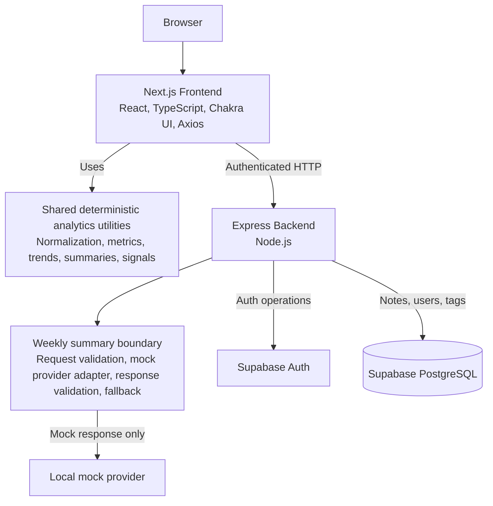

# Workout-Journal System Design

## Scope and Status Language

This document is a concise system-design overview for Workout-Journal. It describes five completed sections in this revision: Requirements, High-level Architecture, Data Model, Component Responsibilities, and API Design.

Every claim below is labelled as one of the following:

- **Current / Implemented**: confirmed in the current repository code.
- **Verified Infrastructure Fact**: confirmed by the reviewed Supabase backup, rather than inferred from application code.
- **Current Design Decision**: an explicit current boundary or policy reflected in code and supporting design material.
- **Future Direction**: a proposed next step, not an implemented capability.
- **Open Question**: not verified from this repository or the reviewed backup.

## 1. Requirements

### Product Goal

**Current / Implemented:** Workout-Journal is a daily workout note application. Its central value is recording workouts by date, revisiting prior sessions, and making progressive overload and training trends easier to inspect through the calendar and Analytics page.

**Current / Implemented:** The primary workflow is intentionally simple: log exercises and sets inside a dated note, then use date-range analytics to review strength, volume, exercise, effort, and growth information before the next session.

### Functional Requirements

| Capability | Status | Current behavior |
| --- | --- | --- |
| Authentication and account management | **Current / Implemented** | The backend supports sign-up, login, session lookup, token refresh, user lookup/update, password reset, and verification-related flows. Sign-up and login use Supabase Auth; the backend then issues its own signed access and refresh JWTs. |
| Daily workout logging | **Current / Implemented** | A note is opened for a date and saved through the authenticated notes API. The calendar links users to dated note screens and displays note/tag state. |
| Exercise and set recording | **Current / Implemented** | A note contains exercises; each exercise has a name, optional exercise note, and a sequence of sets with weight, reps, and rest. Add, duplicate, and delete operations are present in the note editor. |
| Optional set effort input | **Current / Implemented** | An expandable Effort row provides RPE in 0.5 steps from 1 to 10, RIR from 0 to 10, and a failure checkbox. The frontend normalizes these values before saving; backend save normalization preserves valid optional intensity fields. |
| Calendar, history, and tag lookup | **Current / Implemented** | The top page provides a calendar. Notes can be queried by date, date range, and overlapping tags; the note screen can find a prior tagged note. |
| User-defined tags | **Current / Implemented** | Note tags are saved with notes. The backend also creates, lists, and deletes user-scoped tag catalog entries in `user_tags`. |
| Date-range analytics | **Current / Implemented** | The Analytics page fetches the authenticated notes range, normalizes nested sets, and derives analytics for selectable 4-week, 8-week, 12-week, 6-month, and all-time ranges. |
| Exercise trends | **Current / Implemented** | The Exercises tab groups known aliases through current exercise metadata, retains unmatched names as raw groups, supports four metrics, and keeps an exact-value table fallback. |
| BIG3, volume, effort, and Growth Signals | **Current / Implemented** | Analytics shows BIG3 estimated-1RM trends, muscle-group sets or volume load, set-level effort summaries, and five deterministic Growth Signals: strength, volume, consistency, effort, and exercise progress. |
| Weekly summaries | **Current / Implemented** | The frontend builds deterministic aggregate input, renders a rule-based preview, and can call an authenticated backend weekly-summary endpoint backed by a mock provider. |

#### Weekly Summary Boundary

| Area | Status | Current behavior |
| --- | --- | --- |
| Deterministic input and rule-based summary | **Current / Implemented** | Shared utilities build range-bounded aggregate input from note count, normalized sets, BIG3, muscle groups, effort, Growth Signals, and data-quality notes. A rule-based summary renders without an AI call. |
| Backend endpoint | **Current / Implemented** | Express exposes `POST /analytics/weekly-summary`. It validates an authenticated request, accepts structured `summaryInput`, and returns a structured summary plus a source indicator. |
| Provider adapter and mock behavior | **Current / Implemented** | The backend service uses a provider contract with `generateWeeklySummary(promptMessages)`. The default adapter is a local mock that returns a fixed JSON response; invalid responses and provider errors return a rule-based fallback. |
| External AI provider integration | **Future Direction** | No provider SDK, API key, environment setting, or network call to an external AI provider is implemented. |
| Summary persistence | **Current Design Decision** | Generated summaries are returned on demand and are not currently persisted. |
| Summary history or cache | **Future Direction** | Optional persistence or caching needs a separate schema, invalidation, retention, and privacy design. |

### Non-functional Requirements

| Concern | Status | Current boundary or requirement |
| --- | --- | --- |
| Authentication and user isolation | **Current / Implemented** | Protected note and weekly-summary paths extract a Bearer token, verify the backend JWT, and scope note/tag database queries by the verified user ID. |
| Secret management | **Current / Implemented** | Backend Supabase credentials and `JWT_SECRET` are read from backend environment files; browser-visible configuration is limited to `NEXT_PUBLIC_*` values. The README instructs deployments to configure real values outside repository files. |
| Sensitive logging | **Current / Implemented** | The weekly-summary service does not log prompt messages, mock/provider response text, tokens, or workout payloads. Its request validator rejects named raw-note-content fields. |
| Logging policy completeness | **Open Question** | A repository-wide sensitive-logging policy is not enforced centrally. Current auth handlers still log decoded user IDs and Supabase query results, so a broader production logging audit remains necessary. |
| Backward compatibility | **Current / Implemented** | Missing `rpe`, `rir`, and `failure` normalize to `null`; old nested sets remain readable. The backend only adds valid effort fields and otherwise keeps the surrounding exercise/set payload shape. |
| Defensive parsing and validation | **Current / Implemented** | Nested exercises are parsed defensively, numeric metrics require finite values, effort values are range-normalized, and weekly-summary requests and responses are validated before use. |
| CI verification | **Current / Implemented** | GitHub Actions installs root, frontend, and backend dependencies, then runs frontend lint/build, backend syntax checks, and the root Jest suite on pushes and pull requests. |
| Mobile usability | **Current / Implemented** | The note editor and Analytics components use responsive Chakra UI layouts, including collapsible effort controls, stacked summary cards, wrapped controls, and horizontally scrollable data tables. |
| AI privacy and response validation | **Current / Implemented** | The current weekly-summary request is structured aggregate data only; named raw note text fields are rejected. Backend responses are bounded and shape-validated before an `ai` result is returned, with a deterministic fallback on failure. |

### Non-goals

- **Current Design Decision:** Do not immediately migrate to fully normalized workout tables.
- **Current Design Decision:** Do not bulk rewrite existing `notes.exercises` payloads merely to add optional effort fields.
- **Current Design Decision:** Do not initially persist generated weekly summaries, prompt payloads, provider responses, tokens, or secrets.
- **Current Design Decision:** Do not send raw workout note text to the weekly-summary provider boundary.
- **Current Design Decision:** Do not provide medical diagnosis, injury treatment, or a fixed training prescription through summaries or signals.
- **Current Design Decision:** Do not store derived analytics rows before a demonstrated query or product need exists.

## 2. High-level Architecture

### Current Architecture



**Current / Implemented:** The frontend is a Next.js Pages Router application using React, TypeScript, Chakra UI, Axios, and Recharts. It owns interactive note editing, calendar/history screens, authenticated API calls, and responsive Analytics rendering.

**Current / Implemented:** The backend is a Node.js and Express service. It owns authentication handlers, bearer-token verification, note and tag persistence, request validation, and the current weekly-summary endpoint boundary.

**Current / Implemented:** Supabase provides Auth operations and the PostgreSQL-backed data store accessed by the backend Supabase client.

**Current / Implemented:** Shared TypeScript utilities are used by the frontend to normalize persisted note data and compute deterministic metrics, chart series, weekly summary input, rule-based summaries, prompt payloads, response validation, and Growth Signals.

**Current / Implemented:** The backend weekly-summary skeleton is JavaScript-local rather than a runtime import of the shared TypeScript prompt/response helpers. It implements equivalent mock-provider, validation, and fallback boundaries in backend utilities.

**Open Question:** A single cross-runtime strategy for reusing shared TypeScript summary utilities from the JavaScript backend has not been implemented.

### Responsibility Boundaries

| Boundary | Status | Responsibility |
| --- | --- | --- |
| Frontend | **Current / Implemented** | Collect and display note data; attach the access token; fetch user-scoped notes; derive and render analytics; construct the structured weekly-summary request; show rule-based, mocked-endpoint, and fallback states. |
| Backend | **Current / Implemented** | Authenticate requests; enforce user-scoped note/tag database operations; normalize nested exercise intensity fields before saving; validate weekly-summary requests; call the local mock provider boundary; validate provider-shaped responses; return fallback output when needed. |
| Shared analytics | **Current / Implemented** | Parse nested exercise payloads into normalized sets and derive metrics, weekly volume, BIG3 trends, muscle groups, effort summaries, Growth Signals, weekly summary input, and provider-neutral prompt payloads without network or database calls. |
| Supabase | **Current / Implemented** | Authenticate sign-up/login/password operations and store application data accessed by the backend, including `notes`, users, and the user tag catalog. |
| Weekly summary | **Current / Implemented** | Keep deterministic rule-based output available independently of the mocked endpoint; use only structured aggregate input at the current backend boundary; validate returned structured output before rendering it as an endpoint response. |

### API Path Clarification

| Path layer | Status | Observed behavior |
| --- | --- | --- |
| Express internal mounts | **Current / Implemented** | `backend/server.js` mounts `authRoutes` at `/auth`, `noteRoutes` at `/notes`, and `analyticsRoutes` at `/analytics`. The weekly-summary route is therefore `POST /analytics/weekly-summary` inside Express. |
| Frontend API base | **Current / Implemented** | Axios uses `NEXT_PUBLIC_API_URL`, defaulting to `http://localhost:3001`. The weekly-summary client calls `/analytics/weekly-summary`, matching the Express mount when this base points directly at Express. |
| Frontend `/api/*` calls | **Current / Implemented** | Existing auth and notes clients commonly call `/api/auth/*` and `/api/notes/*`. |
| Production/public proxy mapping | **Open Question** | No Next.js rewrite, frontend API route, or hosting proxy configuration is present in this repository to show how `/api/auth/*` or `/api/notes/*` map to Express `/auth/*` or `/notes/*`. The deployed public route mapping must be verified in hosting configuration. |
| Weekly-summary public route | **Open Question** | The repository confirms the internal `POST /analytics/weekly-summary` route and the frontend call with that path. Whether production also exposes an `/api/analytics/weekly-summary` alias is not established here. |

## 3. Data Model

### Verified Persisted Schema

**Verified Infrastructure Fact:** The reviewed PostgreSQL cluster backup documents this `public.notes` table shape:

| Column | Type | Nullability |
| --- | --- | --- |
| `date` | `text` | `NOT NULL` |
| `note` | `text` | nullable |
| `exercises` | `text` | nullable |
| `userid` | `uuid` | nullable |
| `tags` | `text[]` | nullable |

**Verified Infrastructure Fact:** The reviewed backup declares `PRIMARY KEY (date)`, `UNIQUE (date, userid)`, and `FOREIGN KEY (userid) REFERENCES public.users(uuid) ON DELETE CASCADE` for `public.notes`.

**Verified Infrastructure Fact:** The reviewed backup did not show an RLS policy on `public.notes`, nor a trigger or constraint that validates the nested shape inside `notes.exercises`.

### Data Model Risk: Daily Note Key

**Verified Infrastructure Fact:** The reviewed backup contains both `PRIMARY KEY (date)` and `UNIQUE (date, userid)` for `public.notes`.

**Current / Implemented:** `saveNote` upserts a note using `(date, userid)` as its conflict target and adds the verified user ID to the row.

**Open Question:** If `PRIMARY KEY (date)` exists in the live schema, different users cannot each retain a note for the same date. That conflicts with the intended multi-user model of one note per user per date, despite the application's `(date, userid)` upsert target. The live Supabase schema and actual multi-user behavior must be verified. This docs-only change does not modify the schema.

**Open Question:** The backup is verified evidence for the reviewed environment, but this repository does not prove that the current production Supabase schema is identical.

### Persisted Application Shape

| Item | Status | Current representation and persistence boundary |
| --- | --- | --- |
| Daily note | **Current / Implemented** | The frontend `NoteData` contains `date`, `note`, `exercises`, and optional `tags`. The backend stores `date`, `note`, serialized `exercises`, `tags`, and verified `userid`. |
| Exercise | **Current / Implemented** | An exercise is `{ exercise: string, note?: string, sets: Set[] }`. The exercise name and optional exercise note are nested inside the serialized `notes.exercises` payload. |
| Set | **Current / Implemented** | A set has string-form primary input fields `weight`, `reps`, and `rest`. Optional RPE and RIR accept string, number, or null; failure accepts boolean or null. |
| Effort field persistence | **Current / Implemented** | The frontend serializes the exercise array. Backend save normalization accepts an array or JSON string, preserves surrounding exercise/set fields, normalizes valid RPE/RIR/failure values, and omits null/invalid optional effort fields before saving JSON text. |
| Tags on notes | **Current / Implemented** | The save payload always supplies a tags array; the reviewed schema stores it in `notes.tags` as `text[]`. |
| User-created tag catalog | **Current / Implemented** | Backend tag operations read and write `user_tags` rows scoped by `user_id`, and delete uses the `remove_tag_from_notes` RPC to remove a tag from note rows. |
| `user_tags` schema and RPC definition | **Open Question** | The repository code confirms use of `user_tags` and the RPC, but no reviewed DDL for their columns, constraints, policies, or function body is available in this design scope. |

### Derived Analytics Model

**Current / Implemented:** `normalizeWorkoutSets` reads an exercise array or JSON string and produces `NormalizedWorkoutSet` records in the application layer. A normalized set contains the source date and user ID, exercise name and note, set index, numeric-or-null weight/reps/rest, RPE/RIR/failure, and copied tags.

**Current / Implemented:** `addTrainingMetricsToSet` adds derived `volumeLoad` and estimated 1RM. The current estimated-1RM calculation uses weight and reps, rejects non-positive values and repetitions above 12, and does not persist its result.

**Current / Implemented:** The Analytics page derives the following from authenticated range notes on demand; these values are not written back as analytics rows:

| Derived value | Source boundary |
| --- | --- |
| Parsed numeric set fields and effort values | `normalizeWorkoutSets` |
| Volume load and estimated 1RM | `trainingMetrics` |
| Week starts and per-exercise weekly volume with average RPE/RIR | `weeklyTrainingVolume` |
| BIG3 trend points, latest top set, and maximum estimated 1RM | `big3Trend` plus exercise metadata |
| Weekly muscle-group sets and volume load | `muscleGroupVolume` plus exercise metadata |
| Exercise chart series and canonical exercise selector groups | graph utilities and frontend analytics helpers |
| Effort coverage, average RPE/RIR, and failure count | `effortAnalytics` |
| Strength, volume, consistency, effort, and exercise-progress signals | `growthSignals` |
| Structured input for rule-based and future provider-backed summaries | `weeklySummaryInput` |

**Current Design Decision:** Missing effort values are treated as unknown rather than zero or low effort. `failureCount` counts only `failure === true`.

### Exercise Metadata

**Current / Implemented:** `shared/constants/exerciseMetadata.ts` contains a curated metadata list with canonical names, aliases, primary and optional secondary muscles, movement metadata, and optional BIG3 lift types. Case-insensitive alias matching supports the current BIG3, muscle-group, and canonical exercise-trend views.

**Future Direction:** A DB-backed or user-defined custom exercise catalog remains a candidate for future work. It is not an implemented database model or backend feature in this branch.

### Store vs. Derive

| Classification | Status | Examples |
| --- | --- | --- |
| Persist in database | **Current / Implemented** | Daily note fields, serialized nested exercises/sets, note tags, verified user ID, user account records, and user tag catalog entries. |
| Derive on demand | **Current / Implemented** | Normalized sets, numeric parsing, metrics, weekly volume, BIG3 trends, muscle-group volume, exercise series, effort summaries, Growth Signals, weekly summary input, and rule-based summaries. |
| Do not store initially | **Current Design Decision** | Weekly-summary prompt payloads, mock/provider responses, generated summary history, access tokens, refresh tokens, Supabase credentials, and AI-provider secrets are not persisted as application data. |
| Future persistence candidate | **Future Direction** | An optional weekly-summary cache/history, a custom exercise catalog, or normalized workout-set rows may be considered only when a demonstrated product or query need justifies their schema and lifecycle cost. |

**Current / Implemented:** The current weekly-summary input is aggregate data: range bounds, note and set counts, BIG3 aggregates, muscle-group aggregates, effort summary, Growth Signals, and data-quality notes. Raw workout note text is not part of the current provider-facing data shape.

## 4. Component Responsibilities

### Component Boundaries

| Component | Status | Owns | Must not own |
| --- | --- | --- | --- |
| Next.js pages and feature components | **Current / Implemented** | Page routing, interactive note/calendar/account screens, and responsive presentation. | Direct database access, backend service logic, provider secrets, or service-role credentials. |
| Frontend API clients | **Current / Implemented** | Axios base configuration, authenticated request headers, feature-level request wrappers, and response delivery to feature code. | Supabase persistence, business aggregation, or durable UI state. |
| Frontend authentication and token handling | **Current / Implemented** | Local access-token storage, client session checks, redirect behavior, and retrying a failed request after refresh. | Backend JWT signing, refresh-token issuance, server-side revocation, or provider secrets. |
| Analytics page orchestration | **Current / Implemented** | Fetching range notes, normalization, metric aggregation, chart/summary inputs, range-local UI state, and rendering Analytics sections. | Persisting derived analytics, changing note records, or replacing deterministic analytics with a provider result. |
| Express server and middleware | **Current / Implemented** | Environment loading, CORS, JSON/cookie middleware, internal route mounts, and global 404/error middleware. | Feature-specific analytics calculation or provider-specific model behavior. |
| Auth routes and service | **Current / Implemented** | Route registration; Supabase Auth operations; user record updates; backend access/refresh JWT issuance; and protected user/session operations. | Note persistence, training aggregation, or frontend token storage. |
| Note routes and service | **Current / Implemented** | Thin note/tag route registration, bearer-token checks, user-scoped `notes` and `user_tags` operations, note upsert, and nested effort-field normalization. | Computing derived charts/signals or issuing authentication tokens. |
| Shared deterministic analytics utilities | **Current / Implemented** | Pure normalization, metric calculation, trend/volume/effort aggregation, Growth Signals, weekly-summary input, rule-based summary, and provider-neutral prompt data. | Database access, network calls, UI state, Express request handling, or secret access. |
| Weekly-summary route and service | **Current / Implemented** | Bearer-token extraction and authenticated handling, weekly-summary request validation, prompt-message construction orchestration, provider-adapter invocation, provider-shaped response validation, rule-based fallback selection, and HTTP response construction. | Frontend analytics UI state, direct note persistence, generated-summary persistence, provider-specific SDK/configuration details, or secrets exposed to the frontend. |
| Weekly-summary provider adapter | **Current / Implemented** | The narrow `generateWeeklySummary(promptMessages)` contract and the current local mock response. | Authentication, authorization, note-range retrieval, database access, fallback policy, HTTP response construction, or frontend state. |
| Supabase Auth | **Current / Implemented** | Sign-up, password sign-in, password reset, user update, and session operations invoked by the backend. | Application analytics derivation, frontend routing, or weekly-summary generation. |
| Supabase PostgreSQL | **Current / Implemented** | Persisted application records accessed by the backend, including notes, users, and the user tag catalog. | On-demand analytics, Growth Signals, or initial weekly-summary persistence. |
| Exercise metadata | **Current / Implemented** | Static canonical names, aliases, muscle metadata, and BIG3 lift classification used by deterministic analytics. | User-defined exercise catalog persistence, fuzzy matching, or user goal inference. |
| CI verification boundary | **Current / Implemented** | Independent dependency installation plus frontend lint/build, backend syntax checking, and root Jest verification on push and pull request. | Deployment, production health monitoring, or runtime authorization. |

**Current Design Decision:** Frontend code does not receive a backend Supabase key or an AI-provider secret. The current provider adapter is local and mocked; external provider configuration remains outside this implementation.

**Future Direction:** A future external provider call should be isolated behind the provider adapter. Provider SDK, model settings, timeout, and secret access should not leak into routes, frontend code, or shared deterministic analytics. External provider integration is not currently implemented.

**Open Question:** The repository contains `backend/services/userService.js`, but the mounted route modules inspected here do not import it. Its runtime reachability and intended ownership need confirmation before it is treated as part of the HTTP API surface.

### Dependency Direction

**Current / Implemented:** The primary request path is:

```text
UI
-> API clients / feature orchestration
-> Express routes
-> services
-> Supabase
```

**Current / Implemented:** Analytics uses a separate deterministic flow:

```text
Persisted notes
-> normalization
-> deterministic metrics
-> charts / Growth Signals / weekly summary input
-> rule-based or mocked-provider summary
```

**Current / Implemented:** The Analytics page imports shared TypeScript utilities and feature API clients. The inspected backend route and service modules import backend-local utilities; no inspected backend module imports frontend code.

**Open Question:** A repository-wide circular-dependency rule or a runtime strategy for sharing the TypeScript summary utilities with the JavaScript backend is not present. The backend currently maintains local weekly-summary validation, prompt, and fallback logic instead.

## 5. API Design

### API Design Principles

**Current / Implemented:** Notes, tags, authenticated user operations, and the weekly-summary endpoint extract a Bearer token and verify the backend JWT before their user-scoped work. Sign-up, login, forgot-password, and reset-password use their own credential or reset-token flows.

**Current / Implemented:** Express route files are registration layers that delegate handlers to services. The Analytics page derives charts, Growth Signals, and the structured weekly-summary input from an authenticated notes-range response on the frontend; there is no general analytics aggregation API.

**Current / Implemented:** Daily note saving is an upsert, and nested exercises accept the historical JSON-string shape. Backend normalization sanitizes optional RPE, RIR, and failure values while preserving valid older payloads without a migration.

**Current / Implemented:** The weekly-summary boundary accepts structured `summaryInput`, rejects named raw-note-content fields, validates provider-shaped output, and returns a rule-based fallback when the mock provider response is invalid or throws.

### Endpoint Inventory

**Current / Implemented:** The following inventory combines the Express mount in `backend/server.js` with each route module. These are internal Express paths, not an assertion about a production proxy prefix.

#### Authentication / User

| Method | Express path | Authentication | Responsibility |
| --- | --- | --- | --- |
| `GET` | `/auth/session` | Bearer token | Verify the backend token and return the current user's selected profile data. |
| `POST` | `/auth/refresh` | Refresh-token cookie | Verify the refresh token and issue a new backend access token. |
| `POST` | `/auth/signup` | None | Validate sign-up fields, create a Supabase Auth user and application user row, then issue backend tokens. |
| `POST` | `/auth/login` | None | Validate credentials through Supabase Auth, then issue backend tokens. |
| `GET` | `/auth/get-user` | Bearer token | Return the authenticated user's application profile. |
| `PUT` | `/auth/update-user` | Bearer token | Validate and update the authenticated user's profile and selected Supabase Auth attributes. |
| `POST` | `/auth/forgot-password` | None | Request a Supabase password-reset email. |
| `PUT` | `/auth/reset-password` | Reset access token in request body | Establish a Supabase session from the supplied reset access token and update the password. |

#### Notes / Tags

| Method | Express path | Authentication | Responsibility |
| --- | --- | --- | --- |
| `GET` | `/notes/:date` | Bearer token | Return notes matching the requested date and authenticated user ID. |
| `POST` | `/notes/:date` | Bearer token | Normalize nested exercises and upsert one daily note for the authenticated user. |
| `GET` | `/notes/range?start=...&end=...` | Bearer token | Return the authenticated user's notes in the supplied inclusive date range, ordered by date. |
| `GET` | `/notes/all-tags` | Bearer token | Return the authenticated user's tag catalog. |
| `GET` | `/notes/by-tags?tags=...` | Bearer token | Return the authenticated user's notes whose tag array overlaps the supplied comma-separated tags. |
| `POST` | `/notes/tag` | Bearer token | Create a user-scoped tag when it does not already exist. |
| `DELETE` | `/notes/tag/:tagName` | Bearer token | Delete a user-scoped tag and invoke the tag-removal RPC for that user's notes. |

#### Analytics / Weekly Summary

| Method | Express path | Authentication | Responsibility |
| --- | --- | --- | --- |
| `POST` | `/analytics/weekly-summary` | Bearer token | Validate range and structured input, invoke the local mock provider boundary, validate its response, and return an `ai` or `rule_based_fallback` source. |

**Open Question:** Frontend auth and notes clients commonly use `/api/auth/*` and `/api/notes/*`, while the weekly-summary client uses `/analytics/weekly-summary`. No rewrite, Next.js API route, or hosting proxy definition in this repository proves how these public paths map to the internal Express mounts.

**Current / Implemented:** `frontend/features/auth/hooks/useResendVerification.ts` calls `/api/signup` through `apiRequestWithAuth`. That wrapper requires a stored access token and throws before making an HTTP request when no access token exists. The mounted Express signup route is `POST /auth/signup`.

**Open Question:** No repository-visible proxy or rewrite proves that `/api/signup` reaches `POST /auth/signup`. Verification resend is expected to be usable around an unauthenticated signup flow, but the authenticated wrapper may prevent the request from being sent when no access token exists. The intended endpoint, authentication requirement, and deployed reachability need confirmation.

### Authentication and Token Lifecycle

**Current / Implemented:** Sign-up and login call Supabase Auth, then the backend signs a separate access token and refresh token using its own JWT utility. The access token is returned to the frontend and used as a Bearer token for authenticated requests; the refresh token is issued as an HTTP-only cookie.

**Current / Implemented:** The Axios client enables credentials, attaches the stored access token for authenticated calls, and intercepts 401 responses. A request marked for retry is refreshed once; a module-level limit stops repeated refresh attempts and removes the local access token after exhaustion or refresh failure.

**Current / Implemented:** Frontend logout clears the locally stored access token and redirects to login. The associated server logout request is commented out in the current AuthContext.

**Open Question:** No mounted logout endpoint, server-side access-token revocation list, refresh-token rotation, or refresh-token invalidation mechanism was found in the inspected code. Production session invalidation behavior therefore remains unverified.

### Request Validation

| Area | Status | Current validation boundary |
| --- | --- | --- |
| Auth sign-up, login, and profile update | **Current / Implemented** | `authService` checks required fields, email format, and minimum password length where applicable. |
| Password reset | **Current / Implemented** | `authService` checks for a reset access token and a non-empty password with minimum length. |
| Note path and range dates | **Current / Implemented** | `noteService` has no dedicated date-format validator; it passes `:date`, `start`, and `end` to Supabase queries. Malformed direct-request behavior beyond that boundary is not verified. |
| Notes payload | **Current / Implemented** | `saveNote` accepts `note`, `exercises`, and `tags`; nested exercises are normalized by `noteExercisesValidation`. A complete schema for note text and tags is not enforced in the inspected service. |
| Nested exercises and effort | **Current / Implemented** | Backend utility accepts an array or JSON string, safely falls back to `[]`, preserves valid set fields, accepts finite RPE 1-10 and RIR 0-10, and accepts boolean or `"true"`/`"false"` failure values. Invalid optional effort values are omitted before save. |
| Tags | **Current / Implemented** | Tag creation rejects a falsy `tag`; deletion rejects a missing route parameter. Length, character, and normalization rules beyond that are not present in the inspected service. |
| Weekly-summary request | **Current / Implemented** | Backend utility requires an object, valid ordered `YYYY-MM-DD` bounds within 183 days, an object `summaryInput`, and rejects named raw-note-content fields recursively. |
| Provider-shaped summary response | **Current / Implemented** | Backend utility requires the six structured summary fields, string arrays, bounded lengths/counts, and uses a normalized fallback on parse or shape failure. |

### Write Semantics and Idempotency

**Current / Implemented:** `POST /notes/:date` normalizes exercises and uses Supabase upsert with `(date, userid)` as the conflict target. The daily-key risk in the reviewed backup is documented in [Data Model Risk: Daily Note Key](#data-model-risk-daily-note-key).

**Current / Implemented:** Tag creation first checks for an existing user-scoped tag, returning success without a new row when one exists. Tag deletion removes the catalog row and calls `remove_tag_from_notes` for the matching user and tag, so it has a note-record side effect.

**Current Design Decision:** `POST /analytics/weekly-summary` performs no database write. Generated summaries are returned on demand and are not persisted.

### Response and Error Boundaries

**Current / Implemented:** Missing or invalid Bearer tokens commonly return `401` with an `error` field. Auth validation returns `400`; the weekly-summary request validator returns `400` with `error` and `details`; and backend failures generally return `500` with an endpoint-specific error message.

**Current / Implemented:** A requested note with no matching row returns a successful notes collection from the current query path rather than a dedicated not-found response. Auth session/profile lookups can return `404` when the selected user record is absent.

**Current / Implemented:** The weekly-summary service returns `200` with `source: "rule_based_fallback"`, a safe summary, and `validationErrors` when the provider response is invalid or the provider throws. Global Express middleware returns `404` with `Not Found` or `500` with `Internal Server Error` for unhandled paths/errors.

**Open Question:** Response envelopes vary by endpoint: examples include a direct user object, `{ user }`, `{ notes }`, `{ tags }`, `{ message }`, and `{ error, details }`. A consistent API error/response schema is not implemented in the inspected code.

### API Security and Privacy

**Current / Implemented:** Note and tag database operations apply the user ID derived from the verified backend JWT. The backend reads Supabase credentials from server environment variables; frontend configuration is limited to public environment variables.

**Current / Implemented:** The current weekly-summary validation boundary rejects named raw-note fields, and the summary service avoids logging prompt messages or provider response text. The local provider is mocked and no external provider call occurs.

**Current / Implemented:** The weekly-summary endpoint accepts `summaryInput` from the client and does not rebuild it from notes in the current service. Authenticated client-provided aggregate data is therefore not equivalent to server-rebuilt analytics.

**Future Direction:** Before an external provider is introduced, define rate limiting, request-size limits, trusted backend reconstruction of summary input, timeout behavior, and a production logging policy.

### API Open Questions

- **Open Question:** The production mapping between frontend `/api/*` paths and Express `/auth` or `/notes` mounts is not in this repository.
- **Open Question:** API versioning is not present in the inspected route mounts.
- **Open Question:** A common error-response schema is not present across the current services.
- **Open Question:** Server-side refresh-token revocation and rotation are not confirmed.
- **Open Question:** Rate limiting is not present in the inspected Express middleware or weekly-summary service.
- **Open Question:** The weekly-summary input may need backend reconstruction from user-scoped notes before external provider use.
- **Open Question:** The JavaScript backend currently does not reuse the shared TypeScript weekly-summary utilities at runtime.
- **Open Question:** Live Supabase schema, RLS policy, and multi-user isolation behavior require production verification.
- **Open Question:** Resend-verification route mapping and its authentication requirement are unresolved.

## References

- [README](../README.md)
- [Training data model review](./training-data-model-review.md)
- [Training analytics design](./training-analytics-design.md)
- [Exercise metadata design](./exercise-metadata-design.md)
- [Notes exercises schema compatibility](./notes-exercises-schema-compatibility.md)
- [Supabase notes exercises schema verification](./supabase-notes-exercises-schema-verification.md)
- [AI weekly summary design](./ai-weekly-summary-design.md)
- [Weekly summary prompt builder design](./weekly-summary-prompt-builder-design.md)
- [Backend AI weekly summary endpoint design](./backend-ai-weekly-summary-endpoint-design.md)
- [Growth Signals design](./growth-signals-design.md)
- [Verification baseline](./verification.md)
- [Quality improvements](./quality-improvements.md)

## Future Sections

### 6. Async Jobs

### 7. Failure Handling

### 8. Observability
